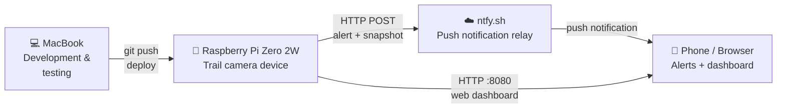
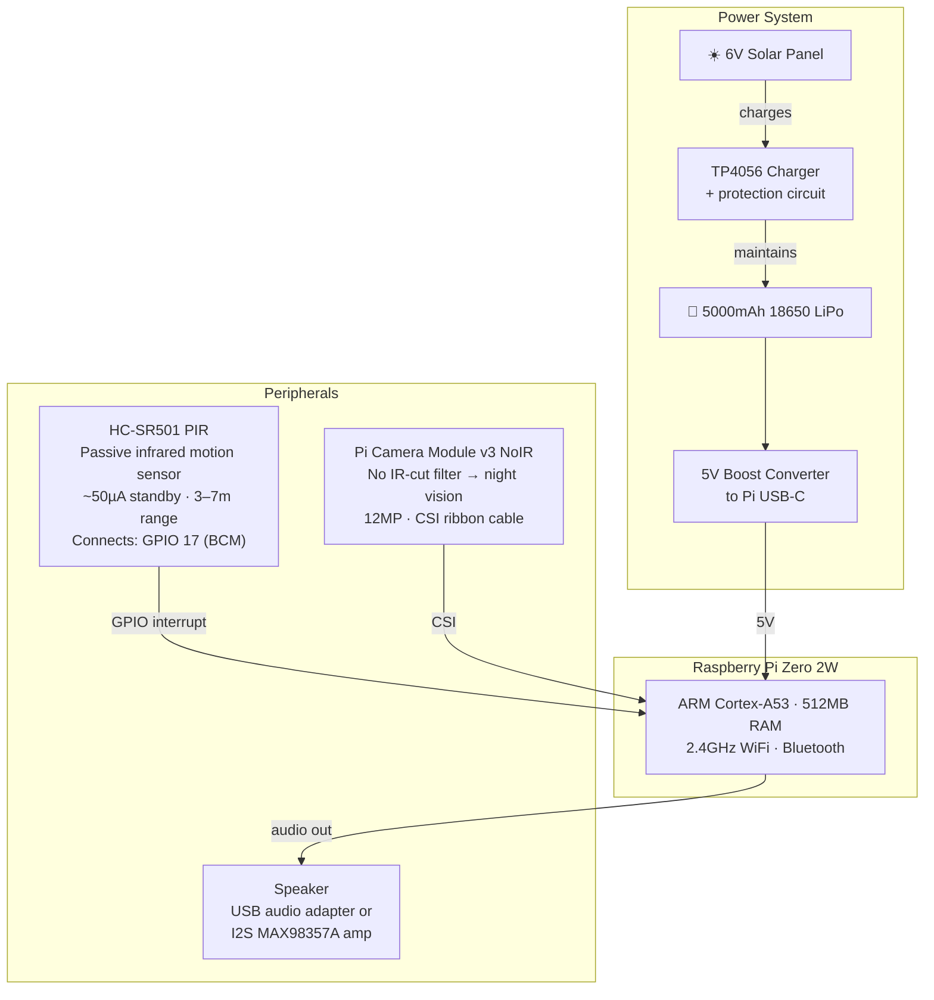
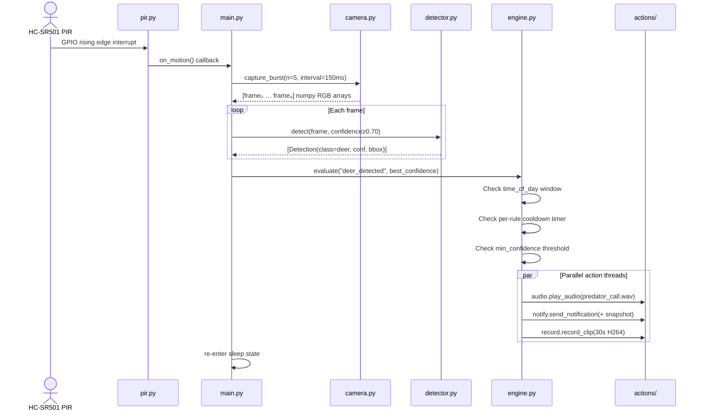
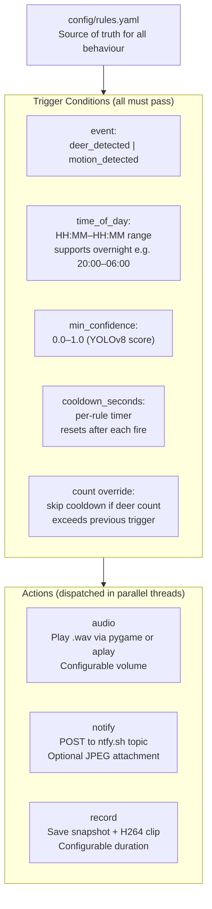
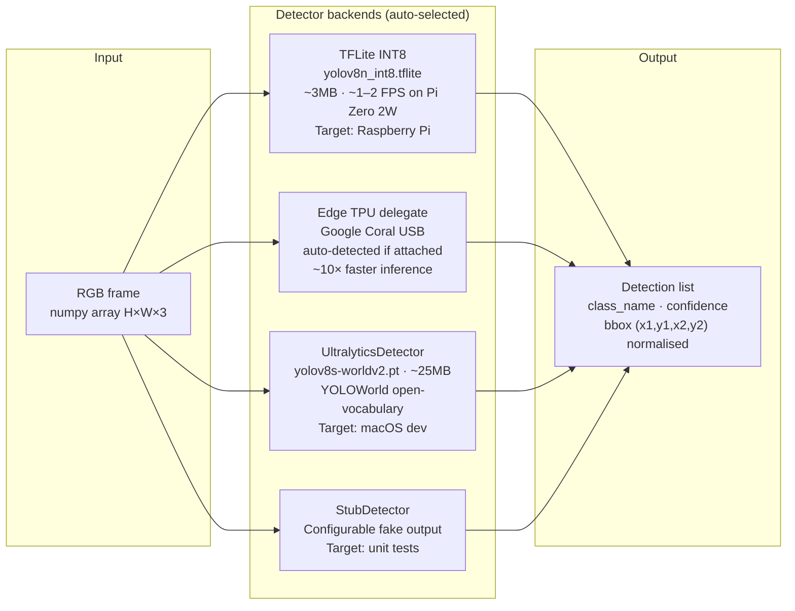
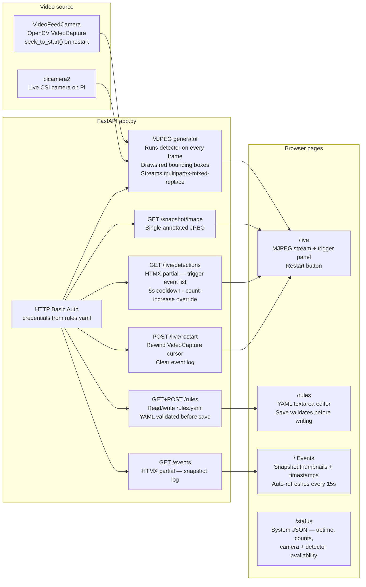
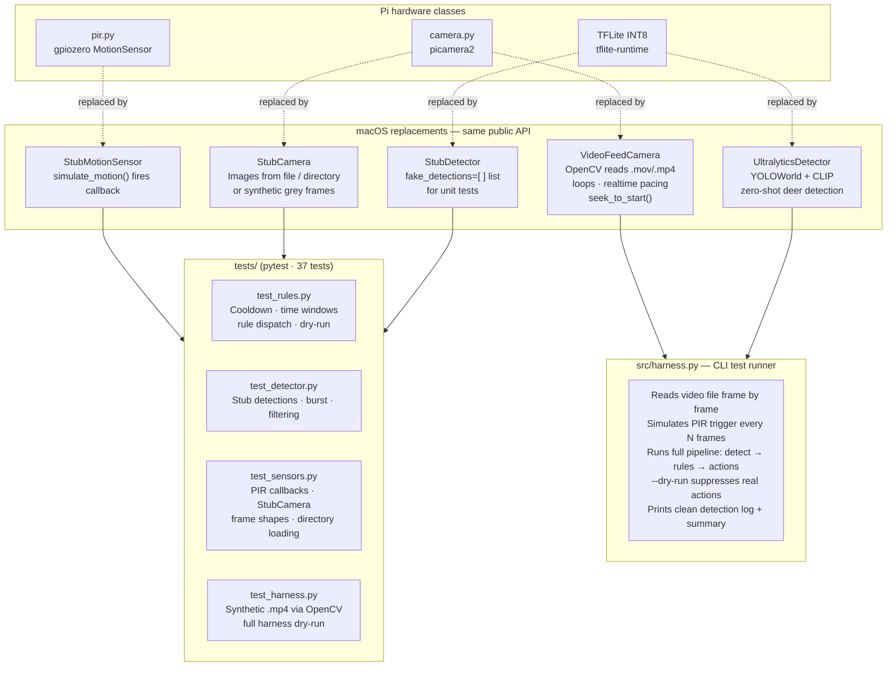

# DeerHunter — System Architecture

## 1. System Context

High-level view of the deployed device, the developer's machine, and external services.



---

## 2. Hardware

Physical components mounted in the weatherproof enclosure.



**Power budget:**
| State | Current | Notes |
|---|---|---|
| Active (inference) | ~300mA @ 5V | Camera + CPU at full speed |
| Idle (PIR polling) | ~15mA | HDMI off, CPU powersave governor |
| Target runtime | ≥3 days | 5000mAh pack without sun |

---

## 3. Core Detection Pipeline

The event flow from hardware interrupt to action dispatch on every motion trigger.



---

## 4. Rules Engine

Rules are defined in `config/rules.yaml` using an IFTTT-style trigger/action model. The engine re-reads the config on each evaluation, so edits via the web dashboard take effect immediately.



**Example rule:**
```yaml
- name: "Deer daytime deterrent"
  trigger:
    event: deer_detected
    conditions:
      min_confidence: 0.70
      time_of_day: "06:00-20:00"
      cooldown_seconds: 120
  actions:
    - type: audio
      file: predator_call.wav
      volume: 90
    - type: notify
      message: "Deer detected!"
      attach_snapshot: true
    - type: record
      duration_seconds: 30
```

---

## 5. ML Detection



> **Why YOLOWorld on macOS?**  Standard YOLOv8n is trained on COCO-80 classes which does not include deer. YOLOWorld uses a CLIP text encoder to match the prompt `"deer"` against visual features, enabling zero-shot detection without a custom model. On the Pi the TFLite model can be fine-tuned on a deer dataset if needed.

---

## 6. Web Dashboard

Served by FastAPI + uvicorn on port 8080. All pages use HTTP Basic Auth. The live stream and trigger panel update without full-page reloads.



---

## 7. macOS Development & Testing

The entire pipeline runs on a MacBook without any Pi hardware. Hardware classes are replaced by drop-in stubs with identical interfaces.



---

## 8. Storage Layout

```
storage/             # gitignored — lives only on device
├── snapshots/       # snap_YYYYMMDD_HHMMSS.jpg  (trigger frame JPEGs)
└── clips/           # clip_YYYYMMDD_HHMMSS.h264  (raw H264 video)
```

The web dashboard event log is built by scanning `storage/snapshots/` — no database required. Events rotate when the snapshot count exceeds the limit configured in `rules.yaml`.

---

## Component Reference

### Hardware

| Component | Part | Role |
|---|---|---|
| SBC | Raspberry Pi Zero 2W | Main compute — runs all software, WiFi |
| Camera | Pi Camera v3 NoIR | IR-capable image capture via CSI |
| Motion sensor | HC-SR501 PIR | Hardware interrupt wake from sleep, ~50µA standby |
| Speaker | USB audio adapter + speaker | Plays deterrent audio (.wav files) |
| Battery | 5000mAh 18650 LiPo + TP4056 | Powers device; TP4056 handles charging + protection |
| Solar | 6V panel + boost converter | Trickle-charges battery for multi-day runtime |
| Enclosure | 3D printed PETG | Weatherproof housing for outdoor deployment |

### Software — Core

| Module | Path | Role |
|---|---|---|
| Orchestrator | `src/main.py` | Event loop, wires all components together, handles signals |
| PIR handler | `src/sensors/pir.py` | Wraps gpiozero MotionSensor; thread-safe callback registration |
| Camera | `src/sensors/camera.py` | picamera2 burst capture + H264 recording; StubCamera fallback |
| Detector | `src/detection/detector.py` | TFLite / YOLOWorld / Stub backends behind a unified API |
| Rules engine | `src/rules/engine.py` | Parses rules.yaml; evaluates time/confidence/cooldown; dispatches actions |
| Audio action | `src/actions/audio.py` | pygame primary, aplay fallback |
| Notify action | `src/actions/notify.py` | ntfy.sh HTTP POST with optional JPEG attachment |
| Record action | `src/actions/record.py` | Saves snapshot JPEG + starts H264 clip recording |
| Power manager | `src/power/manager.py` | Disables HDMI, sets CPU powersave governor on startup |

### Software — Web Dashboard

| Module | Path | Role |
|---|---|---|
| FastAPI app | `src/web/app.py` | All routes, MJPEG generator, detection event store |
| Templates | `src/web/templates/` | Jinja2 HTML; HTMX for partial updates without page reloads |
| Stylesheet | `src/web/static/style.css` | Dark theme, responsive two-column live layout |

### Software — macOS Dev

| Module | Path | Role |
|---|---|---|
| Video feed camera | `src/sensors/video_feed.py` | OpenCV VideoCapture; same API as Camera; loops, rewind |
| Harness | `src/harness.py` | CLI pipeline simulator with clean detection output |
| Tests | `tests/` | pytest suite; all 37 tests run without Pi hardware |
