# DeerHunter — System Architecture

```mermaid
flowchart TB

  %% ── Hardware layer ──────────────────────────────────────────────
  subgraph HW["Hardware (Raspberry Pi Zero 2W)"]
    direction TB
    PIR["HC-SR501 PIR Sensor\nGPIO 17"]
    CAM["Pi Camera v3 NoIR\nCSI ribbon"]
    SPK["Speaker\nUSB audio / I2S"]
    BAT["18650 LiPo + TP4056\n+ 6V Solar Panel"]
  end

  %% ── Core software ───────────────────────────────────────────────
  subgraph CORE["Core Pipeline  (src/)"]
    direction TB

    subgraph SENSORS["sensors/"]
      PIR_PY["pir.py\nGPIO interrupt → callback"]
      CAM_PY["camera.py\nburst capture / H264 record"]
    end

    MAIN["main.py\nOrchestrator & event loop"]

    subgraph DETECT["detection/"]
      DET["detector.py\nYOLOv8n TFLite · COCO class 93\nCoral Edge TPU optional"]
    end

    subgraph RULES["rules/"]
      ENGINE["engine.py\nYAML rules parser\ntime-of-day · cooldown · confidence"]
      YAML["config/rules.yaml\ntrigger / action definitions"]
    end

    subgraph ACTIONS["actions/"]
      AUDIO["audio.py\npygame / aplay"]
      NOTIFY["notify.py\nntfy.sh REST"]
      RECORD["record.py\nJPEG snapshot + H264 clip"]
    end

    PWR["power/manager.py\nHDMI off · CPU powersave\nUSB disable"]
  end

  %% ── Web dashboard ───────────────────────────────────────────────
  subgraph WEB["Web Dashboard  (src/web/)  :8080"]
    direction LR
    FASTAPI["app.py\nFastAPI + uvicorn"]
    MJPEG["MJPEG stream\n/stream"]
    LIVE["Live page\n/live  — annotated frames\ntrigger event panel"]
    RULES_ED["Rules editor\n/rules"]
    EVENTS["Event log\n/  — snapshots + timestamps"]
    TMPL["Jinja2 templates\n+ HTMX polling"]
  end

  %% ── Mac dev layer ───────────────────────────────────────────────
  subgraph DEV["macOS Dev / Testing"]
    HARNESS["src/harness.py\nCLI video feed simulator"]
    VIDFEED["sensors/video_feed.py\nVideoFeedCamera\nOpenCV VideoCapture"]
    YOLOWORLD["UltralyticsDetector\nYOLOWorld  yolov8s-worldv2.pt\nopen-vocab 'deer' prompt"]
    STUB["StubDetector\nfake-deer mode"]
    TESTS["tests/\npytest · 37 tests\nmock GPIO / camera / model"]
  end

  %% ── External ────────────────────────────────────────────────────
  subgraph EXT["External Services"]
    NTFY["ntfy.sh\npush notifications"]
    PHONE["Mobile / Desktop\nbrowser"]
  end

  subgraph STORAGE["storage/  (gitignored)"]
    SNAPS["snapshots/  *.jpg"]
    CLIPS["clips/  *.h264"]
  end

  %% ── Hardware → Software ─────────────────────────────────────────
  PIR -- "GPIO interrupt" --> PIR_PY
  CAM -- "CSI frames" --> CAM_PY
  BAT -- "5V USB" --> HW

  %% ── Core flow ───────────────────────────────────────────────────
  PIR_PY -- "motion callback" --> MAIN
  MAIN -- "capture burst" --> CAM_PY
  CAM_PY -- "numpy frames" --> DET
  DET -- "Detection list\nclass · conf · bbox" --> MAIN
  MAIN -- "evaluate(event, confidence)" --> ENGINE
  ENGINE -- "reads" --> YAML
  ENGINE -- "dispatch threads" --> AUDIO
  ENGINE -- "dispatch threads" --> NOTIFY
  ENGINE -- "dispatch threads" --> RECORD
  AUDIO -- "play .wav" --> SPK
  NOTIFY -- "HTTP POST" --> NTFY
  RECORD -- "write files" --> SNAPS
  RECORD -- "write files" --> CLIPS
  PWR -- "startup tweaks" --> MAIN

  %% ── Web ─────────────────────────────────────────────────────────
  FASTAPI --- MJPEG
  FASTAPI --- LIVE
  FASTAPI --- RULES_ED
  FASTAPI --- EVENTS
  FASTAPI --- TMPL
  MJPEG -- "annotated JPEG frames" --> LIVE
  FASTAPI -- "reads" --> SNAPS
  RULES_ED -- "reads / writes" --> YAML
  FASTAPI -- "set_camera()\nset_detector()" --> MJPEG

  %% ── Dev paths ───────────────────────────────────────────────────
  VIDFEED -- "same Camera API" --> HARNESS
  VIDFEED -- "same Camera API" --> FASTAPI
  YOLOWORLD -- "same Detector API" --> HARNESS
  YOLOWORLD -- "same Detector API" --> FASTAPI
  STUB -- "fake detections" --> HARNESS
  HARNESS -- "evaluates" --> ENGINE

  %% ── Browser ─────────────────────────────────────────────────────
  NTFY -- "push alert" --> PHONE
  FASTAPI -- "HTTP :8080" --> PHONE

  %% ── Styles ──────────────────────────────────────────────────────
  classDef hw fill:#2a3a2a,stroke:#4a7a4a,color:#ccc
  classDef core fill:#1e2a3a,stroke:#3a5a8a,color:#ccc
  classDef web fill:#2a1e3a,stroke:#6a3a8a,color:#ccc
  classDef dev fill:#3a2a1e,stroke:#8a6a3a,color:#ccc
  classDef ext fill:#3a1e1e,stroke:#8a3a3a,color:#ccc
  classDef store fill:#252525,stroke:#444,color:#aaa

  class PIR,CAM,SPK,BAT hw
  class PIR_PY,CAM_PY,MAIN,DET,ENGINE,YAML,AUDIO,NOTIFY,RECORD,PWR core
  class FASTAPI,MJPEG,LIVE,RULES_ED,EVENTS,TMPL web
  class HARNESS,VIDFEED,YOLOWORLD,STUB,TESTS dev
  class NTFY,PHONE ext
  class SNAPS,CLIPS store
```

---

## Layer summary

| Layer | Runs on | Purpose |
|---|---|---|
| **Hardware** | Pi Zero 2W | PIR wake, camera capture, audio output, solar power |
| **Core pipeline** | Pi Zero 2W | Motion → detection → rules → actions |
| **Web dashboard** | Pi Zero 2W (port 8080) | Live stream, event log, rules editor |
| **macOS dev** | MacBook | Video file simulation, open-vocab YOLOWorld, unit tests |
| **External** | Cloud / phone | ntfy.sh push notifications, browser UI |

## Key design principle

`VideoFeedCamera` and `UltralyticsDetector` implement the same interfaces as the Pi hardware classes (`Camera`, TFLite `Detector`), so the entire pipeline — including the web dashboard — runs identically on macOS without any conditional code paths.
