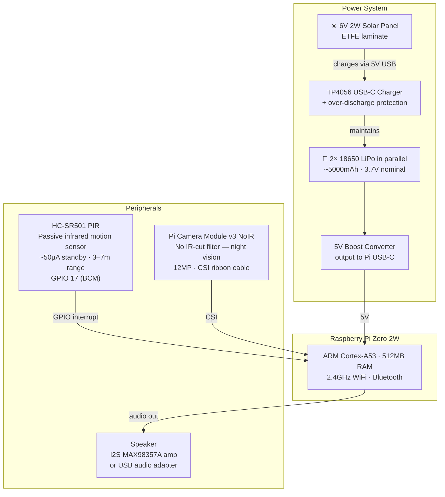
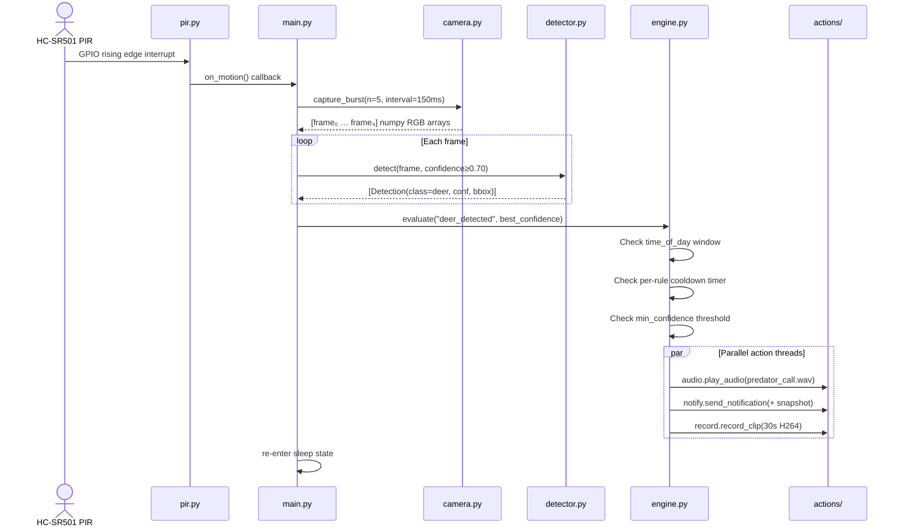
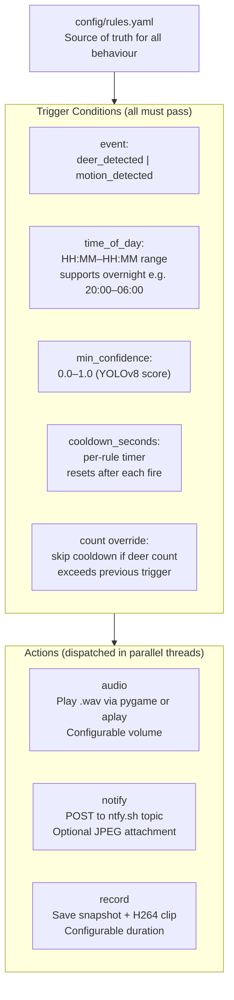
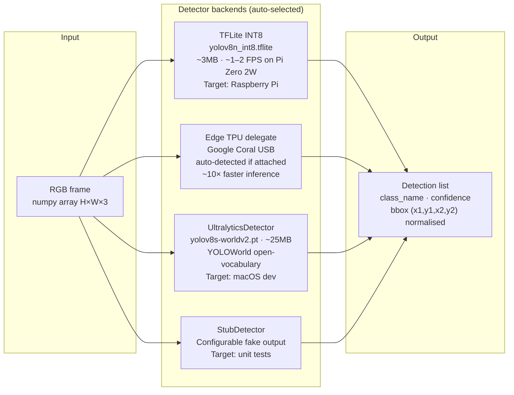
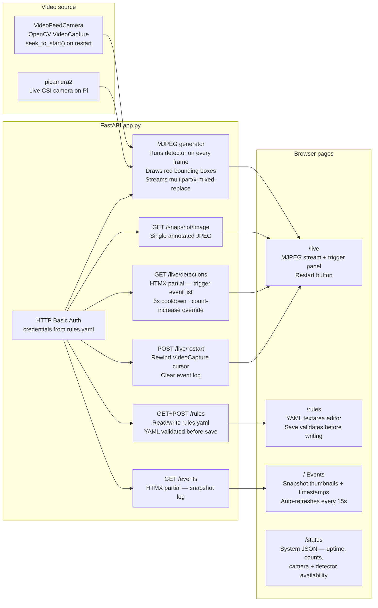
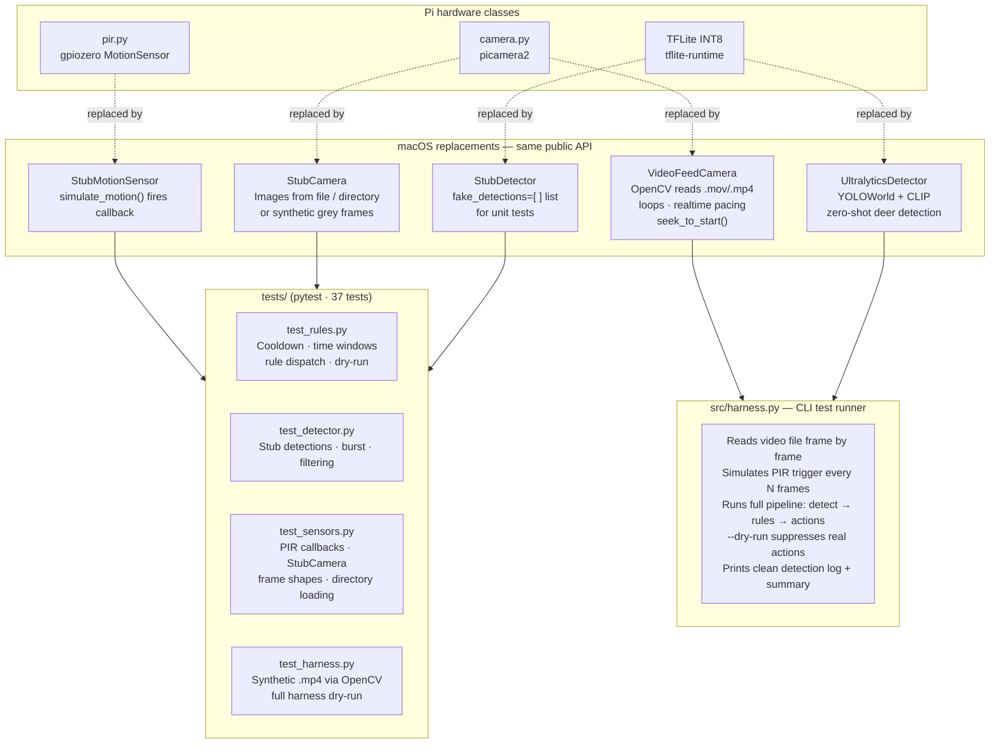

# DeerHunter — System Architecture

## 1. System Context

High-level view of the deployed device, the developer's machine, and external services.


---

## 2. Hardware

Physical components mounted in the weatherproof enclosure.



### Power Budget

**Per-component current draw at 5V:**

| Component | State | Current | Power |
|---|---|---|---|
| Pi Zero 2W — CPU only | Idle, powersave governor | ~80mA | 0.40W |
| Pi Zero 2W — active inference | YOLOv8 TFLite running | ~250mA | 1.25W |
| Pi Camera v3 | Streaming / capturing | ~50mA | 0.25W |
| HC-SR501 PIR | Always on (standby) | ~0.05mA | negligible |
| MAX98357A amp + speaker | Playing audio (50% vol) | ~150mA | 0.75W |
| TP4056 charger circuit | Quiescent | ~3mA | negligible |
| **Idle total** (PIR awake, no inference) | — | **~85mA** | **0.43W** |
| **Active total** (inference + camera) | — | **~300mA** | **1.50W** |
| **Peak total** (inference + camera + audio) | — | **~450mA** | **2.25W** |

**Battery runtime estimates (5000mAh pack, 3.7V → 5V @ ~85% boost efficiency):**

| Scenario | Avg current | Runtime |
|---|---|---|
| Mostly idle, 2 detections/hr (15s active each) | ~95mA | **~47 hours (≈2 days)** |
| Moderate activity, 10 detections/hr | ~140mA | **~32 hours (≈1.3 days)** |
| Continuous inference (stress test) | ~300mA | **~15 hours** |

> Usable capacity ≈ 5000mAh × 3.7V / 5V × 85% efficiency ≈ **3145mAh** at 5V.

**Solar charging:**

| Condition | Panel output | Charge current (after regulation) | Net balance at idle |
|---|---|---|---|
| Full sun (4 peak hours/day) | 6V · 333mA = 2W | ~340mA average into TP4056 | +255mAh/day vs −2280mAh/day consumed → **not enough alone** |
| Full sun (6 peak hours/day, summer) | 6V · 333mA = 2W | ~340mA × 6h = 2040mAh/day | Nearly covers idle consumption |
| Partial overcast | ~80mA effective | ~80mA × 8h = 640mAh/day | Extends runtime by ~7 hours |

> The 6V 2W panel (333mA peak) feeds into the TP4056's 5V USB input via a small buck converter (or used directly if panel Voc ≤ 5.5V). In a typical backyard summer deployment with 5–6 peak sun hours, the panel can sustain near-indefinite operation at idle activity levels. In winter or heavy overcast, the 5000mAh pack provides 2–3 days of buffer.

---

## 3. Core Detection Pipeline

The event flow from hardware interrupt to action dispatch on every motion trigger.



---

## 4. Rules Engine

Rules are defined in `config/rules.yaml` using an IFTTT-style trigger/action model. The engine re-reads the config on each evaluation, so edits via the web dashboard take effect immediately.



**Example rule:**
```yaml
- name: "Deer daytime deterrent"
  trigger:
    event: deer_detected
    conditions:
      min_confidence: 0.70
      time_of_day: "06:00-20:00"
      cooldown_seconds: 120
  actions:
    - type: audio
      file: predator_call.wav
      volume: 90
    - type: notify
      message: "Deer detected!"
      attach_snapshot: true
    - type: record
      duration_seconds: 30
```

---

## 5. ML Detection



> **Why YOLOWorld on macOS?**  Standard YOLOv8n is trained on COCO-80 classes which does not include deer. YOLOWorld uses a CLIP text encoder to match the prompt `"deer"` against visual features, enabling zero-shot detection without a custom model. On the Pi the TFLite model can be fine-tuned on a deer dataset if needed.

---

## 6. Web Dashboard

Served by FastAPI + uvicorn on port 8080. All pages use HTTP Basic Auth. The live stream and trigger panel update without full-page reloads.



---

## 7. macOS Development & Testing

The entire pipeline runs on a MacBook without any Pi hardware. Hardware classes are replaced by drop-in stubs with identical interfaces.



---

## 8. Storage Layout

```
storage/             # gitignored — lives only on device
├── snapshots/       # snap_YYYYMMDD_HHMMSS.jpg  (trigger frame JPEGs)
└── clips/           # clip_YYYYMMDD_HHMMSS.h264  (raw H264 video)
```

The web dashboard event log is built by scanning `storage/snapshots/` — no database required. Events rotate when the snapshot count exceeds the limit configured in `rules.yaml`.

---

## Bill of Materials

Estimated prices as of early 2026. Links are representative — parts are available from multiple vendors.

| # | Component | Part / SKU | Vendor | Unit Price |
|---|---|---|---|---|
| 1 | SBC | Raspberry Pi Zero 2W | PiShop.us | $17.25 |
| 2 | Camera | Pi Camera Module v3 NoIR — Adafruit #5660 | Adafruit | $25.00 |
| 3 | Motion sensor | HC-SR501 PIR sensor | PiShop.us | $3.95 |
| 4 | Amplifier | MAX98357A I2S Class D Amp breakout — Adafruit #3006 | Adafruit | $5.95 |
| 5 | Speaker | 3W 8Ω mini speaker, 40mm — CQRobot | Amazon | $3.99 |
| 6 | Cells | 2× Samsung 35E 18650 3500mAh (series = 7000mAh @ 3.7V) | IMR Batteries | $10.00 |
| 7 | Battery holder | 2S 18650 holder with leads | Amazon | $2.00 |
| 8 | Charger / protection | TP4056 USB-C 1A LiPo charger + DW01 protection | Addicore | $1.80 |
| 9 | Boost converter | 5V 2A MT3608 boost module | Amazon | $1.50 |
| 10 | Solar panel | 6V 2W ETFE solar panel — Adafruit #5366 | Adafruit | $20.95 |
| 11 | CSI cable | 15-pin 30cm FFC ribbon for Pi Zero | Arducam / Amazon | $4.00 |
| 12 | USB-C cable | Short right-angle USB-C (Pi power) | Amazon | $3.50 |
| 13 | Power switch | Rocker switch SPST — SparkFun COM-11138 | SparkFun | $0.75 |
| 14 | Enclosure | 3D printed PETG (≈200g) — Hatchbox 1kg spool | Amazon | $5.20 |
| 15 | Misc | Jumper wires, heat-shrink, M2.5 screws | — | ~$3.00 |
| | | | **Total** | **~$109** |

> **Notes:**
> - The Pi Camera v3 NoIR has no IR-cut filter, enabling night vision with a cheap IR illuminator. The standard v3 (with IR cut) is ~$5 less but loses night capability.
> - Two 18650 cells in parallel (not series) gives ~7000mAh at 3.7V, boosted to 5V. This exceeds the 3-day runtime target without sun.
> - The solar panel's 6V Voc feeds the TP4056's USB-C input directly when panel voltage stays ≤ 5.5V (typical with a Schottky diode drop) or via a small LDO/buck.
> - Optional upgrade: Google Coral USB Accelerator (~$25, Coral store) brings inference from ~1–2 FPS to ~15–20 FPS on the Pi Zero 2W.

---

## Component Reference

### Hardware

| Component | Part | Role |
|---|---|---|
| SBC | Raspberry Pi Zero 2W | Main compute — runs all software, WiFi |
| Camera | Pi Camera v3 NoIR | IR-capable image capture via CSI |
| Motion sensor | HC-SR501 PIR | Hardware interrupt wake from sleep, ~50µA standby |
| Amplifier + speaker | MAX98357A + 3W speaker | Plays deterrent audio (.wav files) |
| Battery | 2× 18650 LiPo + TP4056 | Powers device; TP4056 handles charging + protection |
| Solar | 6V 2W ETFE panel + boost | Trickle-charges battery for extended runtime |
| Enclosure | 3D printed PETG | Weatherproof housing for outdoor deployment |

### Software — Core

| Module | Path | Role |
|---|---|---|
| Orchestrator | `src/main.py` | Event loop, wires all components together, handles signals |
| PIR handler | `src/sensors/pir.py` | Wraps gpiozero MotionSensor; thread-safe callback registration |
| Camera | `src/sensors/camera.py` | picamera2 burst capture + H264 recording; StubCamera fallback |
| Detector | `src/detection/detector.py` | TFLite / YOLOWorld / Stub backends behind a unified API |
| Rules engine | `src/rules/engine.py` | Parses rules.yaml; evaluates time/confidence/cooldown; dispatches actions |
| Audio action | `src/actions/audio.py` | pygame primary, aplay fallback |
| Notify action | `src/actions/notify.py` | ntfy.sh HTTP POST with optional JPEG attachment |
| Record action | `src/actions/record.py` | Saves snapshot JPEG + starts H264 clip recording |
| Power manager | `src/power/manager.py` | Disables HDMI, sets CPU powersave governor on startup |

### Software — Web Dashboard

| Module | Path | Role |
|---|---|---|
| FastAPI app | `src/web/app.py` | All routes, MJPEG generator, detection event store |
| Templates | `src/web/templates/` | Jinja2 HTML; HTMX for partial updates without page reloads |
| Stylesheet | `src/web/static/style.css` | Dark theme, responsive two-column live layout |

### Software — macOS Dev

| Module | Path | Role |
|---|---|---|
| Video feed camera | `src/sensors/video_feed.py` | OpenCV VideoCapture; same API as Camera; loops, rewind |
| Harness | `src/harness.py` | CLI pipeline simulator with clean detection output |
| Tests | `tests/` | pytest suite; all 37 tests run without Pi hardware |
